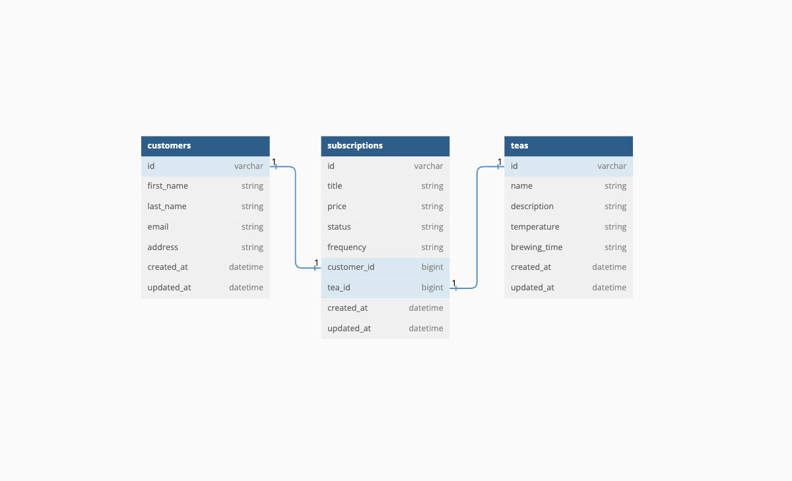

# Tea Subscription

### There is currently no live deployment of this application.

### About

This is an API-only application.

### Setup

```
[Fork and clone this repository]

cd tea_subscription

bundle install
rails db:{drop,create,migrate,seed}
rails s

[Open LocalHost:5000]
```

### Versions

- Ruby 3.2.2
- Rails 7.1.3.4

### Database Schema



### Progress

- [x] End Point 1 - Subscribe a customer to a tea subscription
- [x] End Point 2 - Cancel a customer's tea subscription
- [x] End Point 3 - See all of a customer's subscriptions (both active and cancelled)

### End Points

**End Point 1**
- Create a subscription
- Need to pass in customer's id

```
POST /api/v1/users/:id/subscriptions
Content-Type: application/json
Accept: application/json

{
  "customer_id": "1",
  "tea_id": "1"
}
```

**End Point 1 Happy Path Response**

```JSON
{
  "success": "Subscription created successfully.",
}
```

**End Point 2**
- Update a subscription's status from active to cancelled
- Need to pass in customer's id and subscription_id

```
PATCH /api/v1/users/:id/subscriptions/:id
Content-Type: application/json
Accept: application/json
```

**End Point 2 Happy Path Response**

```JSON
{
  "success": "Subscription cancelled.",
}
```

**End Point 3**
- Retrieve all of a customer's subscriptions
- Need to pass in customer's id

```
GET /api/v1/users/:id/subscriptions
Content-Type: application/json
Accept: application/json
```

**End Point 3 Happy Path Response**

```JSON
{
  "data": [
    {
      "id": null,
      "type": "subscription",
      "attributes": {
          "title": "Subscription to Black Tea",
          "price": "$25",
          "status": "active",
          "frequency": "monthly"
      }
    }
  ]
}
```

### Goals

**Project Completion**

- [ ] Meets all MVP expectations provided by the challenge and is easy to use by the end user.

**Project Completion**

- [ ] Has clear documentation including sections like a summary, setup instructions, endpoints/wireframes, testing instructions, etc. 
- [ ] Clear user stories are built out on the project board and there is a clear progression of tickets moved over to the Done column.

**Final Presentation**

- [ ] Able to speak to process and planning structure. Demos their project and speaks to implementation and tests. Able to speak to and defend their design decisions. Uses good technical terminology.

### Tests

* 23 Total Tests (155 / 155 LOC (100.0%) covered)
* 3 Request Tests (79 / 79 LOC (100.0%) covered)
* 20 Model Tests (83 / 83 LOC (100.0%) covered)

**Testing Instructions**

```
rails db:{drop,create,migrate,seed}
bundle exec rspec spec
```

### Resources

* [GitHub Project Board](https://github.com/users/grantdavis303/projects/1)
* [Tea Temperatures Guide](https://www.kitchenaid.com/pinch-of-help/countertop-appliances/tea-temperatures.html)

### Contributors

* Grant Davis | [GitHub](https://github.com/grantdavis303), [LinkedIn](https://www.linkedin.com/in/grantdavis303/)